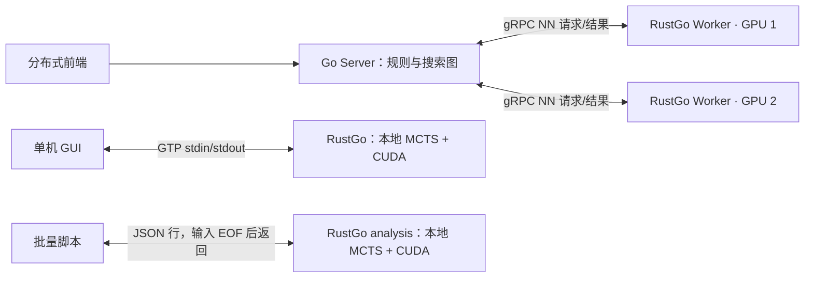

# RustGo：分布式 Worker 与单机分析

更新：2026-09-20。以下按当前源码与本机现有 CUDA release 入口整理。首次使用不强制调优；需要自动选择配置时见 [自动配置优化](RustGo自动配置优化.md)。

## 1. 先选模式

| 项目 | 分布式 Worker | 单机 GTP 分析 | 单机 JSON 批量分析 |
|---|---|---|---|
| RustGo 命令 | `nnworker` | `gtp` | `analysis` |
| 搜索在哪里 | Go Server 维护搜索图并调度评估 | RustGo 本地 MCTS | RustGo 本地 MCTS |
| GPU 的工作 | 接收 Server 的局面评估任务 | 服务本地搜索 | 服务本地搜索 |
| 客户端连接 | 前端连接 Server HTTP/WebSocket | GUI 与引擎 stdin/stdout 交换 GTP | 脚本向引擎 stdin 输入 JSON 行 |
| 是否需要 Go Server | 需要 | 不需要 | 不需要 |
| 主要配置变量 | profile、batch、NN 服务线程、capacity | profile、搜索线程、visits/时间 | 同 GTP，另有局面并发数 |



Worker 不会自己生成落子，也不运行本地搜索树。多 Worker 分担 Server 发出的 NN 评估；不是把若干套 RustGo 本地 MCTS 自动合并成一棵树。两种模式可以使用同一兼容模型，但搜索实现和实际走子结果不保证相同。

## 2. 分布式：先启动 Server，再接 Worker

本机常用 TF3 原始文件：

```text
D:/Go/Server/models/kata1-tf3-b11c768-s11001M-d5973M.bin.gz
SHA-256: 1881600caab9e9d85a3dd6a019e9b8e7d2c237b5f984e13ed49a8645be3077c6
```

Server 与所有 Worker 必须使用同一原始文件哈希。Worker 直接读 `.bin.gz`，无需转 ONNX；Server 只需要预期哈希，模型文件在 Worker 机器。换模型要同步 Server 身份，并选择相匹配的计划。

已有 Server 时跳过启动命令。在独立 PowerShell 窗口启动本机 Server：

```powershell
& D:/Go/Server/target/release/go-server.exe `
  --http 127.0.0.1:8090 --grpc 127.0.0.1:50051 `
  --model-sha256 1881600caab9e9d85a3dd6a019e9b8e7d2c237b5f984e13ed49a8645be3077c6 `
  --max-in-flight 128
```

然后启动日常 Worker：

```powershell
Set-Location D:/code/Rust_KataGo
.\scripts\run_go_worker.ps1 `
  -Server 127.0.0.1:50051 -WorkerId rustgo-5070ti `
  -Model D:/Go/Server/models/kata1-tf3-b11c768-s11001M-d5973M.bin.gz `
  -Config configs/worker_tf3_sm120.cfg -Capacity 32
```

分开部署时，Server 的 gRPC 必须监听 Worker 可达的地址，例如 `--grpc 0.0.0.0:50051`；Worker 的 `-Server` 填 Server 的实际局域网 IP，例如 `192.168.1.10:50051`。`0.0.0.0` 是监听地址，不是 Worker 的连接目标。前端仍连接 Server 的 HTTP/WebSocket 地址；不要让前端连接 Worker 端口。远程前端也需要 Server HTTP 监听相应网卡。

其它机器各自运行 Worker，使用该机模型路径、该机兼容的 CUDA 二进制和该机配置，并分配不同 `WorkerId`。5070 Ti 的认证 plan 不能直接套用到另一 GPU。新机可从 `configs/worker_cuda.cfg` 的基础配置开始，或运行自动配置脚本；无匹配计划时不会继承本机认证性能结论。

| 本机常用负载 | 配置 | capacity | NN batch / 服务线程 |
|---|---|---:|---|
| 日常、低并发或负载不确定 | `configs/worker_tf3_sm120.cfg` | 32 | B16 / S1 |
| 稳定约 C32 在途窗口 | `configs/worker_tf3_sm120_c32.cfg` | 32 | B16 / S1 |
| 长期高并发 | `configs/worker_tf3_sm120_throughput.cfg` | 64 | B14 / S2 |
| 没有匹配认证计划 | `configs/worker_cuda.cfg` | 32 | B16 / 默认 S1 |

这张表是现成启动选择；自动配置脚本会对当前给定负载重新比较这些匹配组合。采用新生成的配置时：

```powershell
# 将路径替换为本次调优输出；启动脚本已保存 capacity、模型路径和 SHA。
.\autotune-output\worker-ready\run-nnworker.ps1 --server 127.0.0.1:50051 --worker-id rustgo-5070ti
```

Server 的 `/api/workers` 可观察注册、完成数及真实 NN rows/batches：

```powershell
Invoke-RestMethod http://127.0.0.1:8090/api/workers | ConvertTo-Json -Depth 8
```

无评估需求时计数不增长是正常的。多个 Worker 的吞吐能否叠加，还取决于 Server 供数、会话窗口、缓存命中、CPU 搜索和网络；capacity 只是接纳上限，不会凭空产生任务。

停止 Worker 用 Ctrl+C，已提交的计算收尾后退出。普通断线默认重连；`-Once` / `--once` 只尝试一次。Server Drain 会排空后退出，不自动重新加入。切换配置时先正常停止旧 Worker。当前真实 Worker 后端只支持 CUDA，dummy 必须显式 `--allow-dummy` 且只用于合成测试。

协议细节、友好 pass、模型身份和数值对拍历史见 [Go Server Worker 接入](Go-Server-Worker.md)。

## 3. 单机：GUI 实时分析用 GTP

不运行 Server。在仓库根目录启动：

```powershell
Set-Location D:/code/Rust_KataGo
.\target\release\katago-rs.exe gtp `
  --model D:/Go/Server/models/kata1-tf3-b11c768-s11001M-d5973M.bin.gz `
  --config configs/gtp_smoke.cfg `
  --override-config "nnBackend=cudabackend,cudaTacticPlan=plans/worker-tf3-sm120.json,nnMaxBatchSize=16,numSearchThreads=12,maxVisits=800"
```

这里复用 TF3 日常推理 plan，并显式补齐本地搜索参数。每手 800 visits 是起步上限，不是最优值或棋力承诺。已有自动配置时可直接执行 `run-gtp.ps1`，或者使用：

```powershell
.\target\release\katago-rs.exe gtp `
  --model D:/Go/Server/models/kata1-tf3-b11c768-s11001M-d5973M.bin.gz `
  --config D:/code/Rust_KataGo/autotune-output/local-ready/rustgo.cfg
```

GUI 中设置：引擎路径 `D:/code/Rust_KataGo/target/release/katago-rs.exe`，工作目录 `D:/code/Rust_KataGo`，参数填写上述从 `gtp` 开始的部分并写成一行。GUI 不能直接执行 `.ps1` 时使用这个二进制入口。生成的 cfg 已写入绝对 plan 路径。

GTP 程序启动后等待输入是正常现象。可交互输入：

```text
boardsize 19
clear_board
komi 7.5
play B D4
play W Q16
kata-analyze B 100
```

`100` 是分析汇报间隔，单位为百分之一秒，即约每秒汇报；用 `stop` 停止，`quit` 退出。`genmove B` 搜索并实际落一手；`kata-analyze` 仅分析当前局面。带 interval 的分析持续到停止，不能把 `maxVisits=800` 当作流式分析自动结束的保证。仅支持 19 路。

## 4. 单机：脚本批量分析用 JSON

`analysis` 从 stdin 接收一行一个 JSON 请求，使用 `id` 区分任务。**当前实现把结果暂存到内存，在 stdin EOF、排队任务完成后集中写 stdout**。因此文档示例使用文件/管道关闭输入；常驻交互或边搜索边显示请使用 GTP。请求中的 `reportDuringSearch` 不能改变当前 stdout 缓冲限制。

以下例子无需先调优，直接使用本机 TF3 日常计划：

```powershell
Set-Location D:/code/Rust_KataGo
$query = '{"id":"game-1-turn-2","moves":[["B","D4"],["W","Q16"]],"rules":"chinese","komi":7.5,"boardXSize":19,"boardYSize":19,"maxVisits":800,"includeOwnership":true}'
$query | .\target\release\katago-rs.exe analysis `
  --analysis-threads 1 `
  --model D:/Go/Server/models/kata1-tf3-b11c768-s11001M-d5973M.bin.gz `
  --config configs/gtp_smoke.cfg `
  --override-config "nnBackend=cudabackend,cudaTacticPlan=plans/worker-tf3-sm120.json,nnMaxBatchSize=16,numSearchThreads=12,maxVisits=800" `
  1> analysis-result.jsonl 2> analysis-engine.log
```

已有自动生成配置时，将 `--config` 指向该 `rustgo.cfg` 并删除示例里的 `--override-config`。批量输入可用 `Get-Content requests.jsonl | ...`。每行 JSON 必须完整，不要把一个请求格式化成多行；stdout 保存结果，stderr 保存日志。

主要字段：

| 字段 | 含义 |
|---|---|
| `id` | 请求标识；并发结果不要只按行号配对 |
| `moves` | 从初始局面开始的完整落子历史，颜色使用 `B` / `W`，pass 使用 `pass` |
| `analyzeTurns` | 可选，要分析的历史步数列表；省略时分析最终局面 |
| `maxVisits` | 本次分析请求的搜索上限 |
| `includeOwnership` | 请求领地估计 |
| `rootInfo` / `moveInfos` | 输出的根局面信息和候选着法、访问数、变化图等 |
| `isDuringSearch` | 中间结果标记；以完成结果为准，当前仍等 EOF 才写 stdout |

`--analysis-threads 1` 表示同时分析一个局面，`numSearchThreads` 是每个局面的搜索线程数。增加局面并发会共同竞争 NN 后端和 CPU，不要把 local 单局调优结论直接当成多局面最优。也不要同时在配置写 `numAnalysisThreads` 又传 `--analysis-threads`，当前命令会拒绝重复指定。大批量请求应分批输入，避免积累太多待输出结果。

## 5. 四个容易混淆的参数

| 参数 | 实际作用 | 对 Worker 是否有效 |
|---|---|---|
| `numSearchThreads` | 一次本地 MCTS 的 CPU 搜索线程数 | Worker 不运行 MCTS，不能靠它提速 |
| `numNNServerThreadsPerModel` | 同一模型的 NN 服务线程/推理 lane 数 | 有效；更多 lane 不一定更快 |
| `nnMaxBatchSize` | 每次物理 NN 推理的 batch 上限 | 有效；不代表每次都能凑满 |
| `--capacity` | Worker 接纳的在途请求上限，含排队与取消后尚未算完的任务 | 有效；不等于 batch，也不是 Server 当前发出的请求数 |

Server 的 `--max-in-flight` 是另一层会话窗口。以 B14/S2/C64 为例：单个物理 batch 上限 14、两个 NN 服务线程、最多 64 个在途请求。这四个数的含义不能互换。

## 6. 常见问题与切换

| 现象 | 排查 |
|---|---|
| Worker 一直重连 | 核对 Server 是否启动、监听地址、端口连通性；不要把 HTTP 8090 当作 gRPC 50051 |
| Worker 已注册但 GPU 空闲 | 查看是否有分析任务，Server 窗口是否供数，缓存是否直接命中 |
| 模型 SHA 不匹配 | 核对原始 `.bin.gz` / ONNX 文件本身，Server 与 Worker 统一；不能仅修改声明哈希 |
| plan 的设备/build/artifact 不匹配 | 使用匹配组合或无 plan 基础配置；不要手改计划身份 |
| JSON analysis 看不到输出 | 当前需要 stdin EOF；文件/管道输入，或改用 GTP 实时分析 |
| GTP 启动后停着不动 | 它在等待 GUI/终端发送协议命令，不会自行落子 |
| 报告速度不一致 | 先区分 MCTS visits/s、NN rows/s、RPC/s，再比较窗口、实际 batch、缓存、网络与 GPU 竞争 |

从 Worker 切到单机分析时，正常退出 Worker 后启动 `gtp` / `analysis`。从单机切回 Worker 时，退出 GUI 引擎后重新接入 Server。模型文件可以共用；配置应采用对应运行模式的结果。

现有认证成果与历史边界见 [性能优化结项记录](RustGo性能优化结项记录.md)。本次说明不把旧实验的“下一步”恢复为待执行任务。
