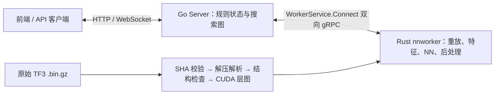

# TF3 权重适配、调优与 Go Server Worker 部署

> 部署说明更新至 2026-09-16。本轮优化已结项；直接启动请看[使用指南](RustGo使用指南.md)，交付身份与结果见[结项记录](RustGo性能优化结项记录.md)。第5、6节保留为今后修改模型/环境时的维护参考，不是本机首次使用前需要重新执行的测试。

历史适配内容初次核对：2026-09-08，依据本地 Rust_KataGo `eb1093fd983cfcd284a81567d41a50239cc1a933` 及整理期间工作区的更新，与后端 `D:/Go/Server` 的 `e42b218` 代码。本文面向负责后端接入和 GPU Worker 部署的同事；命令以本机 Windows PowerShell 为例。

## 1. 先看结论

1. **TF3 已适配，可以直接传原始 `.bin.gz` 权重。** 不需要手动解压、转换 ONNX、训练或重新导出模型。当前验收对象是下表的 b11 Transformer，不能把它理解成支持全部 KataGo/TF3 网络。
2. **首次接入不需要先跑 autotune。** 本机已有三套经过数值和性能验证的 TF3 配置；模型、GPU 和 CUDA 构建指纹匹配时直接使用。没有匹配 plan 时，可先用 `configs/worker_cuda.cfg` 的基础 CUDA 路径完成接入和验证。
3. **Worker 用 `katago-rs nnworker`。** 后端 Server 持有规则状态和搜索图，Rust Worker 只做局面重放与 NN 评估。前端仍连 Server 的 `/ws`，无需修改成连接 Worker。
4. **不要套用旧 ONNX plan，也不要直接运行通用 autotune 当作 TF3 调优。** `plans/best-tactic-plan.json` 绑定 `b11fix.onnx`；`scripts/autotune.py` 当前仍固定该模型和搜索 benchmark。TF3 Worker 使用独立的配置、plan 和 gRPC 性能验证工具。

| 项目 | 当前已验证对象 |
| --- | --- |
| 权重文件 | `D:/Go/Server/models/kata1-tf3-b11c768-s11001M-d5973M.bin.gz` |
| 原始文件 SHA-256 | `1881600caab9e9d85a3dd6a019e9b8e7d2c237b5f984e13ed49a8645be3077c6` |
| 模型内部名称 / 版本 | `b11c768h12nbt3tflrs-fson-silu` / modelVersion 17 |
| 输入 | 19×19，22 个 spatial 特征、19 个 global 特征，CUDA 内部 NCHW |
| 主干 | trunk 768、bottleneck 384；11 个 nested block，每个 3 对 Attention/FFN；12 heads × 32，FFN 1152 |
| 当前 Worker 真实后端 | `cudabackend`，编译需 `--features cuda` |
| 现有 TF3 plan 的目标 | Windows RTX 5070 Ti / SM120，CUDA 编译器 13.3.73、CUTLASS 3.9.2，以及 plan 中记录的 kernel/build 指纹 |

## 2. 最新代码怎样加载 TF3

加载链路如下，部署者只需提供权重文件和 CUDA 配置：



代码已处理原生权重排列、learned RoPE、BN/RMS、SwiGLU、策略头、value/score/ownership 输出和模型携带的后处理系数。它将原生模型描述转换为现有 CUDA 执行器的层图，并非先生成一个外部 ONNX 文件。Worker 返回的是后处理结果：policy 为原始棋盘方向的 361 点加 pass；胜率、目差和 ownership 为白方视角，Server 不应再做一遍 softmax 或翻转视角。

模型身份绑定的是**实际读取的原始文件字节**。Rust 与 C++ Worker 可以共用同一个 `.bin.gz` 加入同一池；即使解压后的权重相同，重新压缩后的文件也可能产生不同 SHA，不能用旧哈希声明身份。`--model-sha256` 是额外校验，不会改写文件的真实身份。

如果要换另一个 TF3 权重：

- 同名、同为 b11、同为 v17 都不能代替结构检查和数值验收。先尝试基础 CUDA 配置；加载器会明确拒绝不支持的形状、层或后处理结构。
- 能加载之后，仍需用该模型的 C++ FP32 参考验证完整协议输出，重新记录模型 SHA，并为目标负载验证配置。
- 同一 Server Worker 池固定一个模型哈希，池为空也不会解除。切换模型需以新目标哈希重启 Server 并重建对应 Worker 池，旧搜索图不能续用；不能将旧 ONNX Worker 与原生 TF3 Worker 混池。
- 当前 `nnworker` 明确拒绝 TensorRT；普通 GTP 支持 TRT 不代表 Worker 已完成 TRT 接入。`dummybackend` 仅能以 `--allow-dummy` 和 `/dev/null` 做隔离合成测试。

具体结构约束见 [`native_model.rs`](../crates/kata_nn/src/native_model.rs)，模型加载与身份见 [`cuda.rs`](../crates/kata_nn/src/backends/cuda.rs) 和 [`evaluator.rs`](../crates/kata_worker/src/evaluator.rs)。

## 3. 要不要 autotune，应该选哪套配置

### 3.1 决策表

| 场景 | 操作 |
| --- | --- |
| 当前本机、同一 TF3 文件、构建指纹匹配，先接后端 | 直接用默认 `worker_tf3_sm120.cfg`，不需要重跑调优 |
| 换机器或重新构建，plan 指纹不匹配 | 用 `worker_cuda.cfg` 跑通并验收；需要恢复优化性能时，对新环境重新验证、调优并生成独立 plan |
| 同环境换成另一份兼容 TF3 权重 | 更新实际模型身份，完成 C++ FP32 对拍；旧 plan 不可直接复用，需要新模型的性能证据 |
| 请求长期维持 C32 或 C64 | 按下表选择对应的已认证配置；capacity 参数本身不会产生足够的请求 |
| 修改 kernel、布局、attention、精度或启用未验收 tactic | 先过相应数值门，再做 ABBA；慢于基线则回退，不通过修改容差或 plan 身份绕过验收 |

普通启动不会自动执行离线 autotune。不配置 `cudaTacticPlan` 时使用内置 tactic 默认值；模型上传、算子准备和 graph warmup 属于初始化，不等于完成了负载调优。Worker 不运行 MCTS，因此 GTP `genconfig` / 搜索线程调优不能替代 Worker 调优。

### 3.2 仓库现有配置

基础、低并发及 C32 配置使用 `nnMaxBatchSize = 16`；Windows C64 吞吐配置现为 14。C 表示在途请求数，B 表示一次实际物理 batch，两者不同。

| 场景 | 配置文件（`configs/`） | plan（`plans/`） | NN 服务线程 | 建议 capacity | 特点 |
| --- | --- | --- | ---: | ---: | --- |
| 首次部署到未认证环境、基础验证 | `worker_cuda.cfg` | 无 | 默认 1 | 32 | 内置 tactic 默认值 |
| 日常部署、低并发或负载不确定 | `worker_tf3_sm120.cfg` | `worker-tf3-sm120.json` | 1 | 32 | DualFFN + q64-serial，保留 CUDA Graph；启动脚本默认 |
| 持续 C32 | `worker_tf3_sm120_c32.cfg` | `worker-tf3-sm120-c32.json` | 1 | 32 | 增加 `nn_k384_b16`；只有实际 B16 及以上启用对应 NN 权重布局 |
| Windows 持续高并发 C64 | `worker_tf3_sm120_throughput.cfg` | `worker-tf3-sm120-throughput.json` | 2 | 64 | B14上限；strict Attention、只读QKV/RoPE、QKV N128、既有half全零FFN通道压缩、输出投影N128；其他批次使用已验证回退路径，关闭CUDA Graph |

C32历史ABBA复验为1066.46→1088.63 uncached RPC/s（+2.08%）。当前Windows
B14/S2/C64认证吞吐为 **1574.822297 uncached RPC/s**（2026-09-16），已经包含
compact FFN、QKV N128和Attention输出投影N128。最后一项的同CLI配对Worker
收益为+1.143208%，完整前向共同墙钟+1.456147%；此前compact FFN的+21.77%
属于另一配对基线，不能相加。FP32累加、精确激活和原数值门不变。
最新额外FFN down NN布局未采纳，正式计划保持；日常及C32配置仍使用各自
策略，Windows新组合不宣称已在WSL认证。详细条件见
[TF3 Worker 性能审计](tf3-worker-performance-audit.md)和[结项记录](RustGo性能优化结项记录.md)。

`capacity` 包括排队和已经接纳但仍未收尾的任务；取消不能立即终止 GPU kernel。提高 capacity 不等于提高 `nnMaxBatchSize`，持续 C64/C128 在单线程 B16 下可能只增加排队时间。

认证 plan 的 tactic 优先级为 **plan > 环境变量 > 默认值**。因此，给已绑定相同键的配置加 `KATAGO_CUDA_*` 环境变量，并不能保证候选生效。调优应使用独立候选 cfg/plan，检查 `[cuda-tactic]` 日志中的实际路径。

### 3.3 为什么不能直接跑 `scripts/autotune.py`

当前脚本固定 `MODEL = D:/code/b11fix.onnx`、`configs/gtp_smoke.cfg`，调用搜索 `benchmark` 并写入 `plans/best-tactic-plan.json`。它没有 TF3 Worker 的完整数值验收步骤，也不是按 gRPC 在途窗口选择配置。只把脚本顶部模型名换成 TF3，仍没有解决这些差异。

当前没有一个可直接执行的“一键 TF3 Worker autotune 并认证 plan”命令。需要进一步优化时，流程是：**独立候选配置 → TF3 C++ FP32 对拍 → Worker ABBA → 记录指纹和证据 → 独立 plan → 用最终 plan 再验收**。修改公共 CUDA 路径还要补原 ONNX/ORT 整图回归；默认策略变更遵守 [CUDA 主规划](cuda-fork-parity-plan.md) 的数值和性能纪律。

## 4. 本机从编译到接入

### 4.1 准备模型和 CUDA 构建

本机已有匹配的认证 release 二进制时，直接进入4.2/4.3；不必重新构建或重新认证。下面的构建流程供缺少二进制或以后主动升级时使用。

运行环境需要 Rust/MSVC、CUDA Toolkit/nvcc 和可用驱动；详细安装步骤见 [编译指南](编译指南.md)。复用当前优化 plan 还需匹配 CUTLASS 和 CUDA 构建能力。基础 CUDA 可以没有 CUTLASS，但要求 DualFFN 的认证 plan 会检查能力并拒绝不匹配的构建。

在 PowerShell 执行：

```powershell
Set-Location D:/code/Rust_KataGo

$modelPath = 'D:/Go/Server/models/kata1-tf3-b11c768-s11001M-d5973M.bin.gz'
$expectedHash = '1881600caab9e9d85a3dd6a019e9b8e7d2c237b5f984e13ed49a8645be3077c6'
$actualHash = (Get-FileHash -LiteralPath $modelPath -Algorithm SHA256).Hash.ToLowerInvariant()
if ($actualHash -ne $expectedHash) { throw 'TF3 model SHA-256 mismatch' }

# 本机现有 CUTLASS 位置；其他部署环境按实际路径调整。
$env:KATAGO_CUTLASS_ROOT = 'D:/code/cutlass'
cargo build -p katago --features cuda --release
if ($LASTEXITCODE -ne 0) { throw 'CUDA build failed' }

.\target\release\katago-rs.exe cuda-fingerprint --model $modelPath
```

`cuda-fingerprint` 用于查看实际模型/GPU/构建身份，本身不会认证某份 plan；真正的校验发生在 Worker 加载配置时。schema 2 会核对 GPU 名称、计算能力、SM 数、L2、模型 SHA、kernel build ID、CUDA 编译器、CUTLASS、编译 SM 列表和能力。控制 GEMM 布局的 C32 plan 还要求匹配 `host_tactic_revision`。Windows/WSL 构建不能假定通用。

迁移到其他安装目录时，需要保留可执行文件、对应的 `configs/`、`plans/` 和模型，确保 CUDA 运行库可被加载。完整源码构建的默认产物是 `target/release/katago-rs.exe`；配置中的相对 plan 路径按进程工作目录解析。

### 4.2 终端 A：启动后端 Server

**如果现有 Server 已固定相同 TF3 哈希且 gRPC 可达，直接进入 4.3 加入 Worker。** 无需另起 Server，也无需给 Server 配置 `nnBackend`、ONNX 或 Rust 可执行文件路径。

需要新起本机 Server 时：

```powershell
Set-Location D:/Go/Server
cargo build --release -p go-server
if ($LASTEXITCODE -ne 0) { throw 'Server build failed' }

.\target\release\go-server.exe `
  --http 127.0.0.1:8090 `
  --grpc 127.0.0.1:50051 `
  --model-sha256 1881600caab9e9d85a3dd6a019e9b8e7d2c237b5f984e13ed49a8645be3077c6 `
  --max-in-flight 128
```

Server 自身只需目标模型哈希，GPU Worker 才加载实际权重。显式指定 SHA 可以避免首次加入的 Worker 决定模型身份。上面的 128 是**每个会话**的搜索在途窗口；Worker 的 capacity 则是该进程服务所有会话的合计上限。单会话要供给 C64，Server 窗口需至少 64，默认 128 已满足上限条件，但不保证实际能持续发满。

后端已有的本机 Server 启动入口也可复用：在 `D:/Go/Server` 执行 `.\scripts\run-cuda-local.ps1 -Component Server -MaxInFlight 128`。它采用该项目的大内存参数和网络监听设置，与上面可执行文件的默认资源参数不同；按现有后端部署习惯选择即可。

后端现有 `D:/Go/Server/scripts/run-cuda-local.ps1 -Component Worker` 启动的是 **C++ Worker**。要启动 Rust，请使用下一节的本仓脚本；不要将 C++ 的单横线参数原样复制到 Rust 命令。

### 4.3 终端 B：启动 Rust Worker

日常默认配置：

```powershell
Set-Location D:/code/Rust_KataGo
.\scripts\run_go_worker.ps1 `
  -Server 127.0.0.1:50051 `
  -WorkerId rustgo-5070ti `
  -Model D:/Go/Server/models/kata1-tf3-b11c768-s11001M-d5973M.bin.gz `
  -Config configs/worker_tf3_sm120.cfg `
  -Capacity 32 `
  -ModelSha256 1881600caab9e9d85a3dd6a019e9b8e7d2c237b5f984e13ed49a8645be3077c6
```

脚本会先解析用户传入的模型/配置路径，再切到仓库根目录启动 release 二进制，退出后恢复原目录。默认就是本机 TF3 模型、`worker_tf3_sm120.cfg` 和 capacity 32。

需要自己配置进程管理器时，等价命令如下；将工作目录设为 `D:/code/Rust_KataGo`：

```powershell
Set-Location D:/code/Rust_KataGo
.\target\release\katago-rs.exe nnworker `
  --server 127.0.0.1:50051 `
  --worker-id rustgo-5070ti `
  --model D:/Go/Server/models/kata1-tf3-b11c768-s11001M-d5973M.bin.gz `
  --model-sha256 1881600caab9e9d85a3dd6a019e9b8e7d2c237b5f984e13ed49a8645be3077c6 `
  --config configs/worker_tf3_sm120.cfg `
  --capacity 32
```

默认配置内容是：

```ini
rules = chinese
komi = 7.5
nnBackend = cudabackend
nnMaxBatchSize = 16
numNNServerThreadsPerModel = 1
nnCacheSizePowerOfTwo = 18
nnMutexPoolSizePowerOfTwo = 14
cudaTacticPlan = plans/worker-tf3-sm120.json
```

棋局上下文、规则和贴目由 Server 请求携带并由 Worker 校验；修改这里的 `rules`/`komi` 不会替 Server 修改棋局。`numSearchThreads` 不是本 Worker 的吞吐配置项。

按负载切换时，保留模型路径/哈希，只替换配置和 capacity。以下仍以本机原始 TF3 文件为例：

```powershell
# 持续 C32；与默认 Worker 二选一运行。
.\scripts\run_go_worker.ps1 -Server 127.0.0.1:50051 `
  -Model D:/Go/Server/models/kata1-tf3-b11c768-s11001M-d5973M.bin.gz `
  -ModelSha256 1881600caab9e9d85a3dd6a019e9b8e7d2c237b5f984e13ed49a8645be3077c6 `
  -WorkerId rustgo-5070ti -Config configs/worker_tf3_sm120_c32.cfg -Capacity 32

# 持续 C64；与上面的 Worker 二选一运行。
.\scripts\run_go_worker.ps1 -Server 127.0.0.1:50051 `
  -Model D:/Go/Server/models/kata1-tf3-b11c768-s11001M-d5973M.bin.gz `
  -ModelSha256 1881600caab9e9d85a3dd6a019e9b8e7d2c237b5f984e13ed49a8645be3077c6 `
  -WorkerId rustgo-5070ti -Config configs/worker_tf3_sm120_throughput.cfg -Capacity 64
```

若报模型/GPU/build mismatch，先核对报错项。需要基础路径时明确选 `-Config configs/worker_cuda.cfg`，并清理此前实验留下的 `KATAGO_CUDA_*` tactic 环境变量，再做验证；不要只改 plan 中的哈希或 kernel ID 来强行启动。

### 4.4 Server 与 Worker 分机

Server 的 gRPC 监听改成 `--grpc 0.0.0.0:50051` 或其实际内网地址；Worker 的 `-Server` 改成可达的 Server 地址，例如 `10.0.0.10:50051`。确保 Worker 到 Server 的 TCP 50051 可达，Worker 主动发起长连接，不需要开放 Worker 的监听端口。`0.0.0.0` 用于监听，不能作为 Worker 的目标地址。

HTTP/WS 是否对其他机器开放，单独由 `--http` 和现有前端部署决定；不要把 Worker 连到 HTTP 的 8090 端口。现有实现按明文 HTTP/gRPC 接入，示例适用于本机或受控内网，不能假定已经配置 TLS/鉴权。

每台 Worker 使用本机模型路径，所有实例的文件 SHA 必须相同，每个同时运行的 Worker ID 必须唯一。多 GPU 可为不同 Worker 配独立 cfg，通过 `gpuToUse = 0` / `1` 选择设备；GPU 与所用 plan 仍需匹配。不要为提高 capacity 在同一 GPU 上无验证地叠加多个进程。

## 5. 接入验收与日常运行

启动后在另一个终端查看：

```powershell
Invoke-RestMethod http://127.0.0.1:8090/health
$pool = Invoke-RestMethod http://127.0.0.1:8090/api/workers
$pool.workers | Select-Object id, model, modelVersion, capacity,
  inFlight, completed, failures, nnRows, nnBatches,
  backendInfo, inputProfile, engineCommit, heartbeatAgeMs
```

`/api/workers` 返回 `{"workers":[...]}`，列表中 `model` 字段就是模型 SHA，`/health` 的对应字段是 `modelSha256`。检查 ID、模型哈希和 capacity 是否符合预期，然后通过原有前端/API 发起一次真实搜索。确认 `completed` 增长、`failures` 不增长，并观察 `nnRows` / `nnBatches`。Worker 有 NN 缓存，重复局面可能命中缓存；因此 RPC 完成数不等于真实推理行数，心跳统计约每 2 秒更新。

当前请求边界为 19 路、`chinese`、半目单位贴目、严格交替的完整历史及支持的 history modes `(false,false)`。终局、非法局面或未支持的历史模式会报错；Worker 不会静默忽略这些语义。当前协议同时支持搜索所需的 friendly pass。

运行行为：默认断线重连，重连间隔 2 秒、心跳间隔 2 秒；`--once` / 脚本 `-Once` 只尝试一次连接。Ctrl+C 停止接单并等待已提交计算收尾；Server 发 Drain 后完成已接纳任务并退出，不再重连。修改 cfg 后需重启 Worker。进程管理器应按部署意图区分故障退出与计划排空。

### 5.1 可重复的真实 Server 冒烟

以下脚本使用随机本机端口和自己创建的子进程，不操作现有 Server。测试结束后生成报告和双方日志：

```powershell
Set-Location D:/code/Rust_KataGo
$py = 'D:/Go/Server/worker/.venv-windows/Scripts/python.exe'
& $py scripts/verify_go_server_worker.py `
  --server D:/Go/Server/target/release/go-server.exe `
  --worker target/release/katago-rs.exe `
  --model D:/Go/Server/models/kata1-tf3-b11c768-s11001M-d5973M.bin.gz `
  --config configs/worker_tf3_sm120.cfg `
  --capacity 32 --output target/worker-deploy-smoke-tf3
```

验收内容包括注册、模型身份、真实 `genmove`、悔棋再搜索、双 pass 终局和任务回收。产物为 `target/worker-deploy-smoke-tf3/report.json` 及日志；检查 PASS 和进程退出码。验收其他 profile 时同时替换 `--config`、`--capacity` 和输出目录。**遗漏 `--model` 会走合成 dummy 夹具，不能用作 TF3 验收。**

混合池验收可在同一命令额外加：

```powershell
# 追加到上面的 verify_go_server_worker.py 参数中：
# --cpp-worker D:/Go/Server/worker/build-windows-CUDA/Release/katago.exe
# --cpp-config D:/Go/Server/worker/cuda-5070ti.cfg
```

混合模式验证同一 TF3 哈希的 C++ 与 Rust 均完成任务，并通过测试中继发 Drain 后退出。上述 Python 路径为本机现有环境；部署机可以换成其他 Python 3.11+，单 Rust 冒烟只需标准库，混合池及下文对拍/基准另需 `grpcio`、`grpcio-tools`。

### 5.2 TF3 数值验收

金标是 **C++ CUDA FP32**，不是 C++ 部署用的 FP16。该流程覆盖协议输入、历史重放、特征、8 个对称方向、输出后处理和视角转换；不能用旧 `b11fix.onnx` 的 ORT 结果代替 TF3 验收。

前置条件是已有能加载同一 TF3 权重的 **C++ CUDA `nnworker` 可执行文件**，并装好 Python gRPC 依赖。第 4 节的 Rust/Server 构建不会生成它；新环境应先按后端的 [C++ Worker 构建说明](D:/Go/Server/worker/README.md) 或 [本机 CUDA 部署](D:/Go/Server/docs/cuda_local_ui.md) 准备，构建时启用 `BUILD_NN_WORKER=ON`。这些链接指向本机的后端 checkout，迁移时按实际路径查阅。

```powershell
Set-Location D:/code/Rust_KataGo
$py = 'D:/Go/Server/worker/.venv-windows/Scripts/python.exe'
& $py scripts/compare_worker_outputs.py `
  --model D:/Go/Server/models/kata1-tf3-b11c768-s11001M-d5973M.bin.gz `
  --cpp-config configs/worker_cpp_fp32.cfg `
  --rust-config configs/worker_tf3_sm120.cfg `
  --request-window 32 --output target/worker-deploy-parity-tf3
```

默认是 16 局面 × 8 对称，共 128 请求。输出 `comparison.json`；要求全部字段过门且 policy top-1 为 128/128。policy/ownership 绝对误差门为 0.005，胜/负/无结果概率为 0.0025，其他标量使用脚本中预先固定的绝对加相对容差。

去掉 `--request-window 32` 即逐请求验收；额外以 `--policy-optimism 1 --policy-temperature 1.3` 和不同输出目录验证乐观头/非默认温度。脚本的 request window 只支持 **1..32**；吞吐配置仍可用它做数值验证，实际 C64 另用冒烟与性能工具验证，不能写成 `--request-window 64`。

更换兼容模型时，需要显式传该文件的 `--model-sha256`，该脚本及基准工具的默认 SHA 固定为本文 TF3。更换 C++ 安装位置时传 `--cpp-worker`；其当前默认是 `D:/Go/Server/worker/build-windows-CUDA/Release/katago.exe`。

## 6. 需要进一步调优时怎样测

先让其他 GPU 负载空闲，再顺序执行对照；不要把多个基准并行占同一张 GPU。以下例子用同一 Rust 二进制对比默认配置与持续 C32 配置：

```powershell
Set-Location D:/code/Rust_KataGo
$py = 'D:/Go/Server/worker/.venv-windows/Scripts/python.exe'
& $py scripts/benchmark_workers.py `
  --model D:/Go/Server/models/kata1-tf3-b11c768-s11001M-d5973M.bin.gz `
  --baseline-worker target/release/katago-rs.exe `
  --baseline-config configs/worker_tf3_sm120.cfg `
  --rust-worker target/release/katago-rs.exe `
  --rust-config configs/worker_tf3_sm120_c32.cfg `
  --order baseline,rust,rust,baseline `
  --concurrency 32 --requests 8192 --warmup 256 `
  --workload uncached --output target/worker-deploy-c32-abba
```

查看 `report.json` 中的实际 NN rows、平均 batch、RPC/s、NN rows/s、RTT 和各轮波动。uncached 模式要求真实 NN 行数等于请求数；cached 模式测的是缓存/请求吞吐，不能作为 GPU 性能提升证据。现有脚本固定要求参与配置明确写 `nnMaxBatchSize = 16`，不负责任意物理 batch 的自动搜索。

当前工作区脚本还分别报告任务 `status` 与 `performance_status`：`PASS` 只代表请求验证通过。可采纳的比较需两侧各至少两轮且 `performance_status = STABLE`；默认重复 spread 门为 5%（`max/min−1`），可在测量前用 `--maximum-relative-spread` 指定。`UNSTABLE_DIAGNOSTIC_ONLY` 或重复不足的报告仅作诊断。每次复测使用新的输出目录，脚本会拒绝覆盖已有 `report.json`。

上面的通用脚本要求 B16，不能直接把候选换成新的 B14 throughput 配置。本轮 B16/B14 对照使用单独冻结的 `target/fork-parity-20260908/g2-strict-attention-integration-r1/best-worker-comparison/run.py`，原始协议、配置快照及 ABBA 记录保存在同目录；它绑定本轮证据身份，修改配置时须重新登记实验。对仍使用 B16 的 C++ 比较，可用 `--order cpp,rust,rust,cpp` 并指定 C++ Worker/部署配置；性能对标的 FP16 配置与数值金标的 FP32 配置分开。

新候选至少保留：模型/二进制/配置哈希、设备与 build 指纹、具体负载、路径日志、完整数值报告和 ABBA 各轮结果。现有 C32 plan 的采纳门为 1%；一次最快成绩或底层 GEMM 微基准不足以说明 Worker 收益。最终要用写入的 plan 再跑对拍和路径检查，确保测到的配置就是上线配置。

`nnbench --mode eval` 可作补充 NN 测量；`--mode direct/kernel` 当前不会安装配置文件里的 `cudaTacticPlan`，只适合显式环境和路径检查下的底层诊断。`fa4-strict-b14-r1` 与精确 Q/K RoPE（V 直接读取原缓冲区）已在上述 Windows C64 profile 验收，AOT/ABI 字节指纹必须匹配。其他 batch 的 strict AOT、WSL 新路径和进一步融合仍属独立候选。

## 7. 常见问题

| 现象 | 核查与处理 |
| --- | --- |
| `nnworker` 不存在或提示 CUDA feature 不可用 | 使用最新源码 `cargo build -p katago --features cuda --release`，确认启动的是 release Rust 二进制 |
| `native CUDA requires ...` | 权重结构不在原生适配范围；先看具体形状/层错误，autotune 不能修复模型兼容性 |
| 模型 SHA mismatch / Server 拒绝加入 | 对比 Server 固定 SHA、Worker 实际文件 SHA 和 plan SHA；不能用参数伪装另一模型 |
| `backend build ... mismatch` / 缺少 DualFFN 能力 | 比对 `cuda-fingerprint` 与 plan；检查 CUDA、CUTLASS、kernel/build，必要时先用基础配置验证 |
| 找不到 plan 文件 | 将工作目录设为仓库根，使用启动脚本，或在自定义 cfg 写绝对 `cudaTacticPlan` 路径 |
| 连接失败 / 持续重连 | 核对 50051 gRPC 地址、Server 监听、网络和重复 Worker ID；远程不要写 127.0.0.1 或 0.0.0.0 作 Server 目标 |
| 注册成功但没有评估 | 通过 Server 发起搜索；查看会话状态、任务与失败数，确认同一模型池和受支持的上下文 |
| 加 capacity 后更慢 | 查看真实平均 batch 和 RTT；单消费者可能已到 B16，排队窗口并非物理 batch |
| 环境变量开关没有效果 | plan 优先级更高；看 `[cuda-tactic]`，使用独立实验配置核实路径 |
| ONNX 或 C++ FP16 数值结果不能通过 TF3 门 | 使用相同原始 TF3 文件及 `worker_cpp_fp32.cfg`，不要放宽容差或跨模型比较 |

## 8. 本次整理的核对范围与维护入口

本次执行了双方 CLI `--help`、三项验证/基准脚本 `--help`、原始 TF3 文件 SHA-256 和当前 release `cuda-fingerprint` 检查，并对照代码、三套配置和 plan。当前本机指纹与三套 TF3 plan 的要求相符；两项目的 `worker.proto` 文件完全一致。

最初的文档整理只核对 CLI、脚本与既有记录；2026-09-09 更新另纳入本轮实测的 FP16 编码修正复验和 strict Attention B14 数值/ABBA/最终安装证据。Worker 检查使用独立本地测试服务，未启动生产 Server。部署到新环境后，按第 5 节用实际二进制和最终配置验收。

| 维护内容 | 入口 |
| --- | --- |
| Worker CLI / 启动脚本 | [`nnworker.rs`](../crates/katago/src/cmd/nnworker.rs)、[`run_go_worker.ps1`](../scripts/run_go_worker.ps1) |
| 原生 TF3 结构转换 / CUDA 加载 | [`native_model.rs`](../crates/kata_nn/src/native_model.rs)、[`cuda.rs`](../crates/kata_nn/src/backends/cuda.rs) |
| 模型身份、重放和结果输出 / 长连接 | [`evaluator.rs`](../crates/kata_worker/src/evaluator.rs)、[`client.rs`](../crates/kata_worker/src/client.rs) |
| 协议定义 | [`worker.proto`](../crates/kata_worker/proto/worker.proto)，与 `D:/Go/Server/proto/worker.proto` 同步 |
| NN 配置装配 / plan 校验 | [`setup.rs`](../crates/kata_program/src/setup.rs)、[`tactic_plan.rs`](../crates/kata_nn/src/tactic_plan.rs) |
| 接入契约、历史验收 | [Go Server Worker 接入](Go-Server-Worker.md) |
| 性能证据及未完成方向 | [TF3 Worker 性能审计](tf3-worker-performance-audit.md) |

更新模型、协议、配置默认值或 build 认证规则时，应同步更新本文；不要把本机 plan 和历史吞吐视为其他设备的性能承诺。
