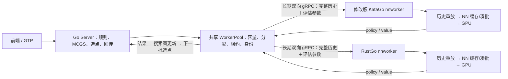

# Go Server / KataGo / RustGo 分布式运行效率评估

日期：2026-09-17。性质：现状考察与实施建议；本文中的新方案尚未实现或验收。

## 1. 结论

**需要优化，优先优化 Server 到 Worker 的低延迟传输、异构调度与并发预算，保留“中心搜索＋远程 NN 评估”架构。完整历史增量协议适合第二阶段，是否启用应由实际网络决定。**

在千兆或更快的低延迟局域网，当前报文大小通常不是两张 GPU 的首要限制；GPU 供料、任务分配、等待时间和搜索反馈新鲜度更值得关注。在公网、低上行带宽或较高 RTT 下，带宽与反馈延迟都可能明显限制效果。压缩请求无法消除逐层搜索的往返依赖。

本次发现一个明确的传输配置缺口：Server 使用原始 `TcpListenerStream` 配合 `serve_with_incoming`，没有给接收的 socket 设置 `TCP_NODELAY`，而 tonic 的默认 TCP 配置在这个入口不生效。建议先修正，再测收益，不能预先宣称减少多少毫秒。

另一个确定的设计问题是调度器把 Worker 声明的最大容量当作性能权重。KataGo 日常脚本默认 capacity=1024，RustGo 高吞吐配置使用 capacity=64；容量差异并不代表算力差异。异构池需要独立的性能估计与目标窗口。

本轮仅检查源码、现有报告、默认本机服务状态，做离线 protobuf 尺寸计算与历史数据汇总；未修改引擎、运行配置或认证计划，未启动 GPU、性能实验或常驻服务。

## 2. 考察范围与证据边界

| 项目 | 本次确认 |
|---|---|
| Server 工作区 | `D:/Go/Server`，HEAD `5bedc675a003a0f8eb44948f6abbc38b069b4520` |
| RustGo 工作区 | `D:/code/Rust_KataGo`，HEAD `ae2a3b79a74a558d3539872724f90c8ea5c62b5f` |
| 两份 Worker 协议 | 字节一致，SHA256 `8a43d78331e64040f44e2c0fe49456d6d75c9ea88b11b111e03473fb48741e5e` |
| 当前默认服务端口 | 本次读取 `127.0.0.1:8090/health`、`/api/workers` 均连接拒绝；未发现 `go-server`、`katago`、`katago-rs` 进程 |
| 本机网卡 | 已连接以太网协商速率 2.5 Gbps；不是端到端可用带宽测量 |
| 历史远端 | 部署文档记录 `192.168.2.28`、`remote-worker-1`、capacity=32；不据此推定现在在线 |
| 尚未知 | 目标部署位置、远端 GPU、实际上下行带宽、RTT/抖动/丢包、同时会话数、对弈时限 |

源码说明当前实现；历史报告说明指定版本和条件下测过什么；下面的带宽表是离线序列化计算。三者不等同于本次实际分布式测速。

Server 目录内修改过的 KataGo Worker，与此前 RustGo 性能优化中使用的 Fork/WSL 对照，不是可以互换的基准对象。不能用 Fork 的纯前向数字推导此处两个 Worker 的速度比。

## 3. 当前方案怎样运行

### 搜索与调度

- Server 每个会话用一个搜索 actor 持有权威搜索图；Worker 不运行自己的搜索树，不决定访问路径。
- `max_in_flight` 默认 128，是每张图的在途路径上限；Worker capacity 是该 Worker 对所有会话共享的物理接纳上限；两者都不是物理 batch。
- 当前调度得分是 `(in_flight + 1) / capacity × max(RPC延迟EWMA, 1ms)`，在尚有容量的 Worker 中选最低分。
- 收到 NN 结果会直接唤醒 actor；活跃等待的 1ms 是结果接收的超时上限，并不是每条结果固定睡眠 1ms。每轮选点最多 32 次或约 3ms，再让控制和结果得到处理。
- 图内有转置复用，正在评估的节点不再次分派；不是完全没有去重。各 Worker 还有自身 NN 缓存。
- 全局 WorkerPool 用一个 mutex 管理分派和回包。分派时还在锁内构造完整 moves；多 GPU、多会话时值得计量锁持有和等待，当前没有证据证明它已经饱和。

源码：[调度和请求](D:/Go/Server/crates/go-server/src/worker.rs:248)、[搜索循环](D:/Go/Server/crates/go-server/src/session.rs:352)、[图内评估状态](D:/Go/Server/crates/go-core/src/search.rs:722)。

### 通信与两个 Worker

Worker 主动连接 Server，每 Worker 一条长期双向流；请求可以并行在途、乱序完成。不是每个评估创建连接，也不是一次只能等一条 RPC。

每条请求独立发送完整落子历史、规则/贴目、语义参数及任务身份。Worker 从初始局面重放，再构造 NN 特征；当前未传输 22×19×19 的原始浮点特征张量。

结果包含 362 个 float32 policy、若干 double 价值字段与身份。**Server 常规搜索已经设置 `include_ownership=false`**，因此没有每次发送 361 点 ownership。以后需要领地显示，可另做根局面按需评估。

| 项目 | KataGo Worker | RustGo Worker |
|---|---|---|
| 请求执行 | 固定计算线程，每条同步调用 evaluator | 每条 `spawn_blocking`，调用同步 evaluator |
| 请求线程与容量 | 创建 capacity 个计算线程；日常脚本默认 1024 | 接纳数受 capacity 约束；Tokio 的 2 个异步线程不是 NN 并发上限 |
| 当前配置入口 | B16 / 单 NN 线程；capacity 由启动参数决定 | 日常 B16/S1；C32 专用 B16/S1；高吞吐 B14/S2/C64 |
| 凑批 | evaluator 内部按就绪请求凑批 | evaluator 内部凑批，存在设备忙/空闲的不同等待路径 |
| 后端边界 | 由 C++ 构建与配置决定 | 当前真实 Worker 认证为 CUDA；模型和 tactic plan 绑定 |

源码：[C++ 线程创建](D:/Go/Server/KataGo/cpp/command/nnworker.cpp:350)、[KataGo 启动默认值](D:/Go/Server/scripts/run-cuda-local.ps1:10)、[Rust 请求执行](D:/code/Rust_KataGo/crates/kata_worker/src/client.rs:283)、[Rust 配置](D:/code/Rust_KataGo/configs/worker_tf3_sm120_throughput.cfg)。

双方均有模型身份、任务身份、租约、取消、断流回收与 Drain。取消后已经进入 GPU 的工作不能立即中止；Server 继续保留物理信用，直到回执或连接回收。这是正确约束，不能为提升表面并发而提前释放。

### 已经完成的优化不能重复计为新收益

Server 已有选边、合法性判断、回传优化；历史固定轨迹 CPU 基准约 3.0–3.6 倍，但没有据此宣称单卡 NN 吞吐同倍提升。C++ Worker 已把任务、输出、控制的条件变量分开，任务入队采用 `notify_one`；历史 1024 线程唤醒风暴已经修复。

见 [Server 工程优化记录](D:/Go/Server/reports/lan-search-perf-20260914/README.md)、[中盘调优记录](D:/Go/Server/reports/midgame-tuning/README.md)。现在仍可减少不必要的请求线程，但不能把旧唤醒风暴当作当前未修复问题。

## 4. 带宽量化

用当前 `.proto` 实际序列化，计入每条 gRPC 的 5 字节消息头（1字节压缩标志＋4字节长度，见[gRPC协议定义](https://github.com/grpc/grpc/blob/master/doc/PROTOCOL-HTTP2.md)）；不含 HTTP/2、TCP/IP、以太网、ACK、TLS/VPN 和重传。固定 36 字符 session ID、32 字节 input hash、64 字符模型哈希。历史长度指“实际棋谱＋搜索分支”的总步数。

| 请求历史 | 请求字节/次 | Server → Worker，1600次/秒 | Worker → Server，1600次/秒 |
|---|---:|---:|---:|
| 空盘 | 205 | 2.6 Mbps | 约 21.8 Mbps |
| 60 手，既有真实夹具 | 591 | 7.6 Mbps | 约 21.8 Mbps |
| 100 手，序列化示例 | 868 | 11.1 Mbps | 约 21.8 Mbps |
| 200 手，序列化示例 | 1532 | 19.6 Mbps | 约 21.8 Mbps |
| 300 手，序列化示例 | 2196 | 28.1 Mbps | 约 21.8 Mbps |

返回报文示例为 1702 字节；其中 policy 数据本体为 1448 字节。若请求 ownership，同一示例增至 3149 字节。100/200/300 手示例仅验证编码尺寸，不执行合法性或推理；实际落点、pass、ID、错误和计时值会改变长度。float32、double 与变长整数的编码规则见 [Protobuf 官方文档](https://protobuf.dev/programming-guides/encoding/)。

1600次/秒取自当前 RustGo 约1575 uncached RPC/s的数量级，不是承诺远程也达到1600。缓存命中可使 RPC/s 高于真实 NN rows/s，因此容量规划应使用实际 RPC 到达率。

由此可判断：

- 两个各1600次/秒的 Worker，在200手时，Server 发送约39.2 Mbps、接收约43.6 Mbps的上述消息量。对千兆全双工链路通常不大；方向分别核算。两种 Worker 若共用一张 GPU，不能按两张卡相加。
- 单 Worker 只有10 Mbps上行时，仅按1702字节返回估计，理论上限约734次/秒；真实可用值还会更低。此时只压缩请求不能解除结果方向的瓶颈。
- 100 Mbps局域网的两 Worker 场景可能够用，但需检查共享上联、其他流量与突发。应为协议开销和波动留余量，不能根据网卡标称值下结论。
- 若改成直接发送22×19×19的FP32特征，单局面仅空间特征就需31768字节，1600次/秒约406.6 Mbps，还未计全局特征。当前棋谱方案在带宽上已经相当节省。

### 前端也占带宽

Server 默认每300ms生成全根候选、最多30步PV的 JSON 快照。离线读取9月14日的历史样本，analysis对象紧凑JSON约52–61 KB，若每300ms发布，约1.4–1.6 Mbps/订阅者，尚未计完整事件封装。此数为历史对象重序列化估计，不是抓包结果。

现有 `watch` 已合并慢客户端未读的快照，但没有按订阅者裁剪候选/PV。公网或多客户端时，可增加“前10–20候选、PV10–15、按需全量、版本化差量”的订阅模式；同一快照预序列化后共享。UI刷新频率影响显示及时性，不等于NN推理速度。源码：[快照生成](D:/Go/Server/crates/go-server/src/session.rs:949)、[WebSocket发送](D:/Go/Server/crates/go-server/src/app.rs:86)。

## 5. 响应速度：已知什么，尚不能断言什么

RustGo 当前认证 B14/S2/C64 的两次历史样本，各8192请求、绕过缓存、固定请求集、Python gRPC测试端：

| 指标 | 运行1 | 运行2 |
|---|---:|---:|
| RPC/s | 1576.04 | 1573.61 |
| 实际平均 batch | 13.93 | 13.91 |
| RPC平均时延 | 40.45ms | 40.53ms |
| RPC p95 | 52.11ms | 52.42ms |
| Worker平均 elapsed | 38.40ms | 38.47ms |
| 平均 context | 24.12μs | 24.19μs |
| 平均 evaluator | 38.37ms | 38.43ms |

来源：[已认证 Worker 配对记录](D:/code/Rust_KataGo/target/fork-parity-20260908/outproj-classic-tn-n128-integration-r1/worker-performance-r1/review.json)。这些时延是C64负载下的单任务等待，不是一次GPU前向耗时，也不是本次Server搜索实测。

9月14日C++中盘B1的历史25个稳态遥测点中，RPC EWMA的中位值24.07ms、Worker elapsed 23.04ms、context 22.7μs、evaluator 23.00ms。它们是“采样到的EWMA的中位数”，不能当作单任务p50/p95，也不能与上表当成公平的C++/Rust速度对照。

因此，当前证据不支持“历史重放已经拖慢本机吞吐”的判断。优化重放仍能减少长期重复工作，但在这些负载下，约24μs与约38ms的数量级说明它不是第一优先级。

`RPC RTT - worker_elapsed` 包含网络、两端发送队列、流控、反序列化和调度开销，不是纯网络RTT。两个p95也不能直接相减。必须按同一任务关联，并单独观测空载往返与传输排队。

并发只能隐藏延迟，不能消除反馈依赖。稳定流水线可用Little定律 `在途数≈完成率×平均总时延`做量纲检查。例如1575次/秒、平均40.5ms，对应约64在途；这是现有数据的关系，不证明C64适合所有网络。

如果保持同样供料和批量行为，可把 `已有本机窗口 + 完成率×新增网络RTT`作为远程初始试验值。相对本机新增20ms，C64约需增加32个信用；新增50ms约增加79个。它们只是初值，仍受带宽、搜索可并行路径和过期工作限制。若两 Worker 都需要更大的窗口，固定每图128可能供料不足；也不能因此无条件提高窗口。

现有C++单卡中盘曾比较128与256图窗口，256未带来明确吞吐收益，故保持128。新网络条件可以重新选点，但不应直接把旧默认调到1024。短时限对弈还要衡量新增并发导致的反馈滞后及取消浪费。

## 6. 推荐实施顺序

### 第一步：传输修正与最小观测，兼容当前协议

1. **Server 显式设置 accepted socket 的 `TCP_NODELAY`。** 保留预绑定 listener 时，可用 `tonic::transport::server::TcpIncoming::from(grpc_socket).with_nodelay(Some(true))`，或者在每次accept后设置并处理错误。仅在 `Server::builder()` 上补 `.tcp_nodelay(true)`无效，因为当前 `serve_with_incoming`忽略它。用锁定的tonic 0.14.6本地源码核实；[官方TcpIncoming文档](https://docs.rs/tonic/0.14.6/tonic/transport/server/struct.TcpIncoming.html#method.with_nodelay)提供该入口。位置：[main.rs](D:/Go/Server/crates/go-server/src/main.rs:83)。
2. **在现有计时基础上增加逐Worker分布与字节计数。** 请求/结果实际编码字节、RPC p50/p95/p99、context、evaluator、发送排队、返回后等待actor应用的时间、实际batch分布、取消尾部NN rows、同会话/跨会话派发量。以采样或直方图实现，避免逐条同步写日志。
3. **增加应用层轻量往返探针或专门测量通道。** 探针单独报告，不把拥堵流内的ping或ICMP直接当业务延迟。跨机器只传阶段持续时间，避免直接相减未同步的墙钟时间。
4. **记录负载条件。** GPU物理身份、模型/配置/二进制哈希、capacity、计算线程数、NN线程数、batch、CPU与网络上下行。现有`latencyMs`等EWMA继续保留，但不能拿来冒充尾延迟。

`TCP_NODELAY`解决潜在的小包等待，不能消除应用层队列，也不保证现有连接已经受到Nagle影响。HTTP/2流控先量测再调整；长RTT、高速率下按“单方向字节速率×RTT”核对需要的窗口，分别检查两端的stream/connection窗口。gRPC发送API接纳消息不等于消息已经上网，见 [gRPC流控说明](https://grpc.io/docs/guides/flow-control/)。

### 第二步：调度分配与窗口独立于硬容量

**将三个概念分开：硬接纳容量、实际算力、Server当前允许派发的目标在途数。**

现有公式在空载、同为10ms延迟时，capacity1024的得分约0.0098，capacity64约0.1563，仅容量就造成16倍评分差距。这不是最终任务比例证明，但说明它会把“能排很多队”误当成“应该多给工作”。

建议在 [WorkerPool](D:/Go/Server/crates/go-server/src/worker.rs:248)维护：

- `hard_capacity`：沿用Hello声明，只做接纳安全上限。
- `target_inflight`：由配置起点、实时排队、供料和任务时限控制，不超过硬容量。
- `throughput_estimate`：在有足够供料的窗口估计完成率；单独记录cache命中背景，不能将空闲时低完成率误认作低算力，也不能用纯NN rows替代热缓存任务的完成率。
- `completion_estimate`：预测当前负载下新任务何时返回；由“当前在途数对应的实测延迟曲线/分档＋新增链路开销”估计，并持续校准。不要把已有排队的RPC延迟再与完整队列时间相加而重复计费。

调度先检查容量、健康和时限，再选预计及时返回且有空余目标信用的Worker。启动时给兼容Worker少量探测任务，避免零延迟初值导致一侧垄断；吞吐模式逐步扩窗，p95恶化但有效完成率不增加时缩窗。所有会话共享每Worker预算，并采用轮转/加权公平分配，防止单会话持续抢占。

交互模式给根初始化、落子后新根、临近deadline任务优先使用低尾延迟Worker；后台长分析可以使用较远Worker。传入会话剩余预算或服务端截止时间，停止发出预计来不及被应用的任务；相对租约从Worker接收时起算，不能替代Server自己的截止时间。

Server在图窗口与Worker窗口之间统一做背压。取消任务继续占物理信用；仅停止派发的熔断不释放信用。收到终态回执，或按现有断流与连接epoch回收契约完成处理后，才回收对应信用；不通过重复发同一评估来制造“吞吐”。

### 第三步：按实际负载选择配置，减少线程与排队浪费

先保持现有GPU认证配置，分离比较各变量：

| 场景 | 推荐作为试验起点的配置 | 判定依据 |
|---|---|---|
| 单个RustGo，短对弈/低并发 | 日常B16/S1，capacity32 | 首结果和固定时限质量；不是已证明最优低延迟配置 |
| 单个RustGo，持续长分析 | 现认证B14/S2/C64 | 约1575 uncached RPC/s是已有本机依据 |
| C++ B16/S1 | 先对照capacity32/64/128，再决定是否替换1024 | 平均batch、NN rows、p95、CPU/线程资源；不能直接假定32更快 |
| 两个独立GPU、低RTT LAN | 各自配置与窗口独立，图上限128作为既有起点 | 分别与各单Worker比较，确认双方供料及图反馈 |
| 公网/高RTT | 根据实测额外RTT扩目标窗口，限制过期任务 | 有效结果与相同时限搜索质量，不能只追求满GPU |

C++应新增与capacity独立的请求计算线程设置。第一版仍同步调用evaluate时，线程数决定同时进入evaluator的请求数，因此不能机械设成“CPU核数”而破坏GPU凑批；以32/64等能覆盖GPU流水线的数值为候选，再测定。长远才考虑将短CPU准备与异步NN等待分离。

RustGo的`spawn_blocking`也让等待evaluator的请求占用线程；当前C64不构成已证实的瓶颈，但扩到很大capacity时应检查blocking池、8MiB线程栈设置及调度成本。无需为此先改造整个执行框架。

两种Worker如果运行在同一张5070 Ti上，先选一个引擎作为日常运行实例；并跑会竞争算力、显存和缓存，不能算双GPU扩展。只有受控实测证明并跑有益时才采用。不同GPU即使同型号也必须分别确认计划指纹和模型身份。

### 第四步：带宽触发的协议优化

对两Worker千兆LAN，暂不把有状态协议列为首个必做项。若消息占可用带宽比例明显升高、发送排队可见、Worker因传输供料不足，或长历史CPU准备确实变重，再做下列兼容扩展。

**推荐：不可变的公共根历史＋每次搜索分支。**

1. 为新能力加明确协商；不支持的旧Worker继续使用完整v1请求。两份proto、Server、C++和Rust同时维护契约。
2. Server给Worker注册公共根上下文，内容包括完整历史、初始状态、规则/贴目与history模式。Worker严格校验一次，保存自己的原生Board/BoardHistory快照。
3. 评估请求携带`context_id + suffix_moves + 完整输入身份 + NN语义参数`。每个任务从不可变快照复制，再重放分支。第一条请求可携带完整根定义，避免每次新根强制增加一次额外RTT。
4. 上下文以精确历史身份及影响重放的参数索引，不能仅按最终棋盘或现有graph_key缓存；必须保留ko、pass、终局/friendly-pass和下一执子方等信息。
5. 用连接epoch、会话/generation和不可变context身份隔离重连、悔棋与新局。缓存有字节上限和LRU，活跃任务持有引用；未就绪/被驱逐返回专门的context-miss，Server限次重发完整上下文，不能把它当作非法棋局或无限重试。context-miss作为该次物理请求的终态回执，释放原请求信用；仍有效的逻辑评估使用新task_id重新申请信用，旧回执不能释放或完成新请求。
6. 保持现有任务唯一性、模型哈希、原始输入hash回显、取消与排空契约。若重新定义输入哈希，需版本化覆盖全部NN语义，不能直接把现有只覆盖局面历史的hash当任意参数组合的缓存键。

以200手根历史、约10手搜索分支为例，请求可望由约1.5KB降到约0.3–0.4KB，取决于最终schema，约减少75%左右请求量；1.7KB返回仍在，总往返字节通常只下降约35–40%。这是结构估算，不是已实现尺寸或速度收益。

若只需降低带宽，低风险替代项是新增无状态紧凑moves编码：严格交替时省略逐手颜色，以固定16位索引或packed整数表示361点及pass，每手约2字节。保留完整合法性重放，牺牲部分可节省的CPU换取更简单的生命周期。不能在原字段上静默改变编码。

结果方向保持完整FP32 policy和原价值精度。低上行场景先实测无损压缩的字节收益与CPU/p95代价；不默认启用逐条gzip，也不首先采用FP16、top-k或概率裁剪。这些有损变化会改变搜索输入，超出纯传输优化。若仍然卡在结果带宽，应限制远端分配或改善链路。

不另设“等待凑齐一批才发RPC”的长窗口：当前已有推理端凑批。可合并同一时刻已经就绪的消息，但关键根任务和结果应及时发送，避免叠加网络凑批与GPU凑批延迟。保留连接复用符合 [gRPC性能建议](https://grpc.io/docs/guides/performance/)。

### 第五步：有观测证据后才扩大范围

- 多Worker、多会话出现池锁争用时，把报文准备移到锁外，锁内只做短临界区的选Worker/预留信用/登记任务，发送失败须原子回滚；随后才考虑分片或actor化WorkerPool。
- 跨会话重复输入较多时才考虑Server精确NN缓存与singleflight；键包含模型、完整语义、ownership需求及约定的引擎/精度兼容范围，有界内存。当前已有图内复用和Worker缓存，收益需要用重复率证明。
- 公网主要是UI而非Worker流量时，先做订阅裁剪和差量快照。
- 高RTT下单局短时限收益不足时，优先把整局/整项分析与搜索Server放到GPU附近，用户只传棋谱和分析摘要；需要多任务吞吐时可按会话分区。跨机器独立子树再合并属于新的搜索算法项目，不宜作为本轮默认改造。

## 7. 如何验证和决定是否采用

未来实施采用逐项、有限次数的验证，避免把未稳定的测试不断叠加为结论。以下是计划，本轮未执行。

1. **建立A/B/C：** A=单个KataGo Worker，B=单个RustGo Worker，C=两个独立GPU混合池。同一物理卡上的两进程另列资源竞争实验。再分别比较各优化前后，不把换引擎/换GPU和网络优化合并成一个收益。
2. **两层负载：** 固定请求集测RPC、字节和尾延迟；真实Server测固定时长搜索、首结果、固定阈值到达时间、有效NN结果、visits与取消浪费。开局、中盘、长历史各有样本；单会话为起点，再做少量并发会话。
3. **网络分档：** 本机回环、目标实际LAN、目标实际公网分别记录。需要定位因素时，再受控加入RTT/带宽限制；准确记录单向延迟还是RTT、限制方向和带宽单位。
4. **数值与生命周期先过门：** 模型/配置身份一致；压缩无损、上下文分支等价；非法历史、friendly pass、悔棋/换根、驱逐、取消、租约、重复和断流重连正确。GPU数值变更仍遵守仓库整图对拍和原门，本方案不要求改数值路径。
5. **分开冷/热缓存：** `skip_cache=true`只绕过读，不等于清空。固定重启/填充顺序，等待取消任务物理排空及新心跳；用NN rows/batches报告真实前向，RPC/s和visits/s分列。
6. **正式性能比较用ABBA：** 固定模型、二进制、配置、请求集、并发和网络；每项预先登记指标及波动上限，一次配对后决定采纳/拒绝/暂缓。收益低于噪声或慢于基线即不采用，不宣称未经测量的百分比。
7. **建议采用门：** 交互项以RPC/首结果p95改善为主，吞吐和有效搜索质量不得出现超过预登记容许范围的退化；吞吐项以固定时长有效结果或质量阈值到达时间改善为主。可把“主指标≥5%改善、非主指标≤3%退化”作为讨论起点，最终根据基线噪声预先定门。无损协议另要求相同请求/配置下重建特征和数值满足原门。

搜索请求的完成顺序会随调度变化，所以同一秒的visits或轨迹不同不自动表示错误或棋力提高。搜索质量使用多局面、同时间/同NN预算的比较；未达到参考阈值的样本保留并报告，不丢掉失败或较慢样本。双GPU扩展效率另报 `混合池有效吞吐 / 两GPU各自独立有效吞吐之和`，并注明会话与缓存条件。

现有入口可复用：[Rust/C++固定请求Worker测量](D:/code/Rust_KataGo/scripts/benchmark_workers.py)、[Server固定时长搜索测量](D:/Go/Server/scripts/benchmark_search.py)、[Server测量契约](D:/Go/Server/docs/search_benchmark_v1.md)。现有脚本不自动覆盖全部远程网络、上下文协议和新调度场景，需要补齐对应观测，不能将历史测试通过当作新方案通过。

## 8. 建议本轮后续工作的明确范围

第一批落地：**accepted socket的NODELAY、实际消息字节/尾延迟观测、调度性能权重与硬容量解耦、按Worker控制目标窗口。** 保持当前模型、GPU数值和搜索评分公式，比较短交互与持续分析两种工作方式。

第二批按网络证据决定：公共根上下文/紧凑moves、无损结果压缩、UI裁剪。线程分离和池锁缩短按实际资源压力推进。现阶段不需要重写通信框架、使用RDMA、传原始特征张量或改成分布式子树搜索。

本报告给出优化必要性与具体路径；尚不能给出目标部署的加速百分比，因为本次没有在线业务样本，也没有目标网络的上下行和RTT数据。

## 9. 本次离线资料

- [报文尺寸及历史计时汇总](D:/code/Rust_KataGo/target/distributed-efficiency-audit-20260917/offline-evidence.json)
- [离线核算脚本](D:/code/Rust_KataGo/target/distributed-efficiency-audit-20260917/inspect_payloads.py)：仅生成协议类、计算序列化长度和读取既有JSON；不启动引擎/服务。
- [RustGo性能结项记录](D:/code/Rust_KataGo/docs/RustGo性能优化结项记录.md)、[使用指南](D:/code/Rust_KataGo/docs/RustGo使用指南.md)
- [Server部署手册](D:/Go/Server/docs/deployment_configuration_guide.md)、[协议schema](D:/Go/Server/proto/worker.proto)

`target/`离线资料为本机产物，受Git忽略；本文已保留主要数字、计算边界与源码定位。引擎改动和新测试应作为后续明确实施任务推进。
